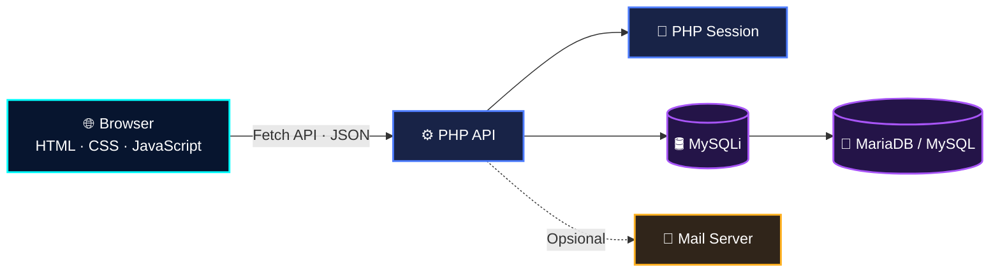

<div align="center">
  

  <h1>HEXS PORTFOLIO</h1>
  <p><strong>Website portfolio pribadi yang interaktif, responsif, dan penuh kreativitas.</strong></p>
  <p>
    Dibangun dengan HTML, CSS, dan JavaScript yang dikombinasikan dengan animasi GSAP,
    audio visualizer, serta sistem komentar berbasis PHP dan MySQL.
  </p>

  <p>
    <a href="https://github.com/HEXS1010/new-porto-2">
      
    </a>
    <a href="https://github.com/HEXS1010/new-porto-2/issues">
      
    </a>
    <a href="https://github.com/HEXS1010/new-porto-2/stargazers">
      
    </a>
  </p>

  <p>
    
    
    
    
    
    
  </p>
</div>

<br>

<div align="center">
  <h2>✨ Preview</h2>
  
  <p><sub>Tampilan utama HEXS Portfolio — tema gelap, starfield, dan neon cyan.</sub></p>
</div>

---

## 📖 Tentang Project

**HEXS Portfolio** adalah website portfolio pribadi milik **Aswameda (HEXS)** yang menggabungkan estetika retro-pixel dengan visual neon dan interaksi modern. Project ini dibuat tanpa framework frontend agar ringan, mudah dipelajari, dan tetap fleksibel dikembangkan.

Selain menampilkan profil, perjalanan belajar, project, skill, dan pencapaian, website ini juga menyediakan sistem komentar persisten dengan autentikasi admin berbasis PHP session.

### 🌟 Fitur Utama

<table>
  <tr>
    <td width="33%" valign="top">
      <h3>🎨 Visual Neon</h3>
      <p>Tema gelap dengan warna neon cyan, kartu interaktif, glow, dan layout responsif.</p>
    </td>
    <td width="33%" valign="top">
      <h3>✨ Animasi Dinamis</h3>
      <p>Loading screen, shine effect, typing role, starfield, orbit technology, dan scroll animation.</p>
    </td>
    <td width="33%" valign="top">
      <h3>🎵 Audio Experience</h3>
      <p>Audio player dengan visualizer menggunakan Web Audio API dan animasi bar real-time.</p>
    </td>
  </tr>
  <tr>
    <td width="33%" valign="top">
      <h3>💬 Komentar Persisten</h3>
      <p>Komentar disimpan di MariaDB/MySQL melalui PHP API dengan prepared statements.</p>
    </td>
    <td width="33%" valign="top">
      <h3>🔐 Admin Session</h3>
      <p>Login admin menggunakan password hash dan session server-side untuk menghapus komentar.</p>
    </td>
    <td width="33%" valign="top">
      <h3>📱 Responsif</h3>
      <p>Navigasi mobile, grid adaptif, orbit avatar, dan footer parallax yang tetap ringan.</p>
    </td>
  </tr>
</table>

### 🧩 Bagian yang tersedia

- **Home** — hero, typing role, audio player, avatar orbit, dan sosial media.
- **About Me** — kartu profil interaktif yang dapat dibalik.
- **Story** — timeline perjalanan belajar dan berkarya.
- **Gallery** — tab project, achievement, dan skill.
- **Comment** — pengiriman, pembacaan, serta moderasi komentar admin.
- **Contact** — informasi kontak, tautan sosial, dan footer grid interaktif.

---

## 🛠 Technology Stack

| Layer | Teknologi | Kegunaan |
|---|---|---|
| **Frontend** | HTML5 | Struktur halaman dan semantic content |
| **Frontend** | CSS3 | Responsive design, neon UI, card, dan animasi |
| **Frontend** | JavaScript ES6 | Interaksi, DOM, Fetch API, dan state UI |
| **Animation** | GSAP + TextPlugin + ScrollTrigger | Timeline, typing effect, dan scroll trigger |
| **Media** | Web Audio API | Audio visualizer |
| **Icon & Font** | Font Awesome, Google Fonts | Ikon sosial media dan tipografi retro |
| **Backend** | PHP 8 | Endpoint komentar dan autentikasi admin |
| **Database** | MySQL / MariaDB | Penyimpanan data komentar |
| **Database Driver** | PHP MySQLi | Koneksi, prepared statement, dan query |
| **Format Data** | JSON | Request dan response API |

### Arsitektur



---

## 🚀 Quick Start

### 1. Clone repository

```bash
git clone https://github.com/HEXS1010/new-porto-2.git
cd new-porto-2
```

Project tidak membutuhkan `npm install`, `composer install`, atau framework tambahan.

### 2. Install kebutuhan sistem

Pada Linux Ubuntu/Debian:

```bash
sudo apt update
sudo apt install -y php-cli php-mysql php-mbstring mariadb-server
sudo systemctl enable --now mariadb
```

Verifikasi extension yang dibutuhkan:

```bash
php -v
php -m | grep -E 'mysqli|mbstring'
mariadb --version
```

> PHP 8.0+ direkomendasikan. Pastikan extension `mysqli` dan `mbstring` aktif.

### 3. Siapkan database

Masuk ke MariaDB:

```bash
sudo mariadb
```

Jika perintah tersebut tidak tersedia, gunakan `sudo mysql`.

Jalankan SQL berikut:

```sql
CREATE DATABASE IF NOT EXISTS portofolio_db
  CHARACTER SET utf8mb4
  COLLATE utf8mb4_unicode_ci;

USE portofolio_db;

CREATE TABLE IF NOT EXISTS comments (
  id INT UNSIGNED NOT NULL AUTO_INCREMENT,
  name VARCHAR(255) NOT NULL,
  message TEXT NOT NULL,
  created_at TIMESTAMP NOT NULL DEFAULT CURRENT_TIMESTAMP,
  PRIMARY KEY (id)
) ENGINE=InnoDB DEFAULT CHARSET=utf8mb4;

CREATE USER IF NOT EXISTS 'portfolio_user'@'localhost'
  IDENTIFIED BY 'GANTI_DENGAN_PASSWORD_DATABASE';

GRANT ALL PRIVILEGES ON portofolio_db.*
  TO 'portfolio_user'@'localhost';

FLUSH PRIVILEGES;
EXIT;
```

### 4. Buat konfigurasi `.env`

Salin contoh konfigurasi:

```bash
cp .env.example .env
```

Isi `.env` dengan credential lokalmu:

```dotenv
DB_HOST=localhost
DB_PORT=3306
DB_USER=portfolio_user
DB_PASS=GANTI_DENGAN_PASSWORD_DATABASE
DB_NAME=portofolio_db
ADMIN_PASSWORD_HASH=GANTI_DENGAN_HASIL_PASSWORD_HASH
MAIL_ENABLED=false
```

Buat hash password admin:

```bash
php -r 'echo password_hash("password_admin_kamu", PASSWORD_DEFAULT), PHP_EOL;'
```

Salin output hash ke `ADMIN_PASSWORD_HASH`. Jangan menaruh password admin dalam bentuk plaintext.

### 5. Jalankan website

Dari root project:

```bash
php -S 127.0.0.1:8000
```

Buka browser di:

```text
http://127.0.0.1:8000
```

### 6. Cek koneksi

```bash
php -r 'require "backend/db.php"; echo "Koneksi database berhasil\n";'
```

---

## ⚙️ Environment Variables

| Variable | Default | Keterangan |
|---|---|---|
| `DB_HOST` | `localhost` | Host database |
| `DB_PORT` | `3306` | Port MariaDB/MySQL |
| `DB_USER` | — | User database aplikasi |
| `DB_PASS` | — | Password user database |
| `DB_NAME` | `portofolio_db` | Nama database |
| `ADMIN_PASSWORD_HASH` | — | Hash dari `password_hash()` |
| `MAIL_ENABLED` | `false` | Aktifkan notifikasi email melalui `mail()` |

> 🔐 File `.env` sudah masuk `.gitignore`. Jangan pernah commit credential, hash password, atau file database.

---

## 🔌 Backend API

Semua endpoint mengikuti struktur berikut:

```text
http://127.0.0.1:8000/backend/<endpoint>
```

| Method | Endpoint | Akses | Fungsi |
|---|---|---|---|
| `GET` | `/backend/get_comments.php` | Publik | Mengambil semua komentar |
| `POST` | `/backend/save_comment.php` | Publik | Menyimpan komentar baru |
| `POST` | `/backend/admin_login.php` | Publik | Membuat session admin |
| `GET` | `/backend/admin_status.php` | Publik | Mengecek status session |
| `POST` | `/backend/admin_logout.php` | Publik | Mengakhiri session admin |
| `POST` | `/backend/delete_comment.php` | Admin | Menghapus komentar |

### Contoh menyimpan komentar

```bash
curl -X POST http://127.0.0.1:8000/backend/save_comment.php \
  -H "Content-Type: application/json" \
  -d '{"nama":"Aswameda","komen":"Portfolio-nya keren!"}'
```

Response sukses:

```json
{
  "status": "success"
}
```

Komentar dibatasi maksimal **450 karakter**.

---

## 💾 Project Structure

```text
new-porto-2/
├── audio/                       # Audio untuk hero player
├── backend/                     # API PHP
│   ├── admin_auth.php           # Helper autentikasi dan session
│   ├── admin_login.php          # Endpoint login admin
│   ├── admin_logout.php         # Endpoint logout admin
│   ├── admin_status.php         # Endpoint status admin
│   ├── db.php                   # Koneksi dan loader .env
│   ├── delete_comment.php       # Hapus komentar oleh admin
│   ├── get_comments.php         # Ambil daftar komentar
│   └── save_comment.php         # Simpan komentar baru
├── css/
│   └── style.css                # Seluruh style frontend
├── img/                         # Logo, avatar, screenshot, dan icon
├── js/
│   ├── footer.js                # Grid parallax footer
│   └── script.js                # Animasi dan fitur interaktif
├── .env.example                 # Template konfigurasi
├── .gitignore                   # Proteksi file lokal dan secret
├── animasi.html                 # Demo shine animation
├── index.html                   # Halaman utama portfolio
└── README.md                    # Dokumentasi project
```

---

## 🧪 Validasi Lokal

Cek syntax seluruh file PHP:

```bash
for file in backend/*.php; do
  php -l "$file"
done
```

Cek API komentar:

```bash
curl http://127.0.0.1:8000/backend/get_comments.php
```

Response tanpa komentar:

```json
[]
```

---

## 🛡️ Catatan Keamanan

- Password database dan password admin hanya disimpan di `.env`.
- Password admin diverifikasi menggunakan `password_verify()`.
- Query tulis menggunakan prepared statement.
- Session login berada di sisi server dan cookie menggunakan `httponly` serta `sameSite=Lax`.
- Pengunjung biasa tidak menerima akses hapus komentar; endpoint delete mengembalikan `403` tanpa session admin.
- Output komentar di browser di-escape untuk mengurangi risiko XSS.
- Untuk production, gunakan **HTTPS**, Apache/Nginx + PHP-FPM, dan `display_errors=Off`.
- Built-in server `php -S` hanya direkomendasikan untuk development.

---

## 🖼️ Project Showcase

<table>
  <tr>
    <td align="center" width="33%">
      
      <br><strong>Website Sekolah</strong>
      <br><sub>Sistem informasi sekolah berbasis web</sub>
      <br><br>
      <a href="https://github.com/HEXS1010/web-sekolah/blob/main/index.html">Lihat source →</a>
    </td>
    <td align="center" width="33%">
      
      <br><strong>Web Belajar</strong>
      <br><sub>Project lomba desain web 2025</sub>
      <br><br>
      <a href="https://github.com/HEXS1010/projek">Lihat source →</a>
    </td>
    <td align="center" width="33%">
      
      <br><strong>HEXS Portfolio 1</strong>
      <br><sub>Versi pertama website portfolio</sub>
      <br><br>
      <a href="https://github.com/HEXS1010/portofolio-1">Lihat source →</a>
    </td>
  </tr>
</table>

---

## 🏆 Pencapaian

<table>
  <tr>
    <td align="center" width="50%">
      
      <br><strong>Penghargaan Lomba Web Desain UNDIKSHA</strong>
      <br><sub>Project website pembelajaran bertema teknologi.</sub>
    </td>
    <td align="center" width="50%">
      
      <br><strong>Modul Dasar AI — Dicoding</strong>
      <br><sub>Konsep dasar AI, cara kerja model, dan penerapannya.</sub>
    </td>
  </tr>
</table>

---

## 🧑‍💻 Profil Pembuat

<div align="center">
  
  <br><strong>Aswameda — HEXS</strong>
  <br>
  <sub>Pelajar dan penjelajah teknologi yang sedang belajar desain web, front-end, Python, dan cybersecurity.</sub>
  <br><br>

  <a href="https://github.com/HEXS1010">
    
  </a>
  <a href="https://www.instagram.com/swameda.k?igsh=aTB3bXNlMzk0dWVm">
    
  </a>
  <a href="https://www.tiktok.com/@logar1230?_r=1&_t=ZS-91FZpOlKbKP">
    
  </a>
  <br><br>
  <a href="mailto:aswameda18@gmail.com">aswameda18@gmail.com</a>
</div>

---

## 🤝 Kontribusi

Kontribusi sangat diterima. Kamu dapat membantu melalui:

1. Membuka issue untuk 환 atau laporan bug.
2. Mengirim pull request dengan perubahan yang terfokus.
3. Menambahkan dokumentasi, optimasi, aksesibilitas, atau fitur baru.
4. Menjaga credential tetap aman dan tidak meng-commit file `.env`.

Sebelum membuka pull request, pastikan syntax PHP valid dan fitur utama tetap berfungsi di browser.

---

## 🛟 Troubleshooting

| Masalah | Solusi |
|---|---|
| Halaman tidak terbuka | Pastikan `php -S 127.0.0.1:8000` masih berjalan |
| Gagal memuat komentar | Periksa service database, tabel `comments`, dan konfigurasi `.env` |
| Extension `mysqli` tidak ditemukan | Install `php-mysql`, lalu restart PHP |
| Extension `mbstring` tidak ditemukan | Install `php-mbstring` |
| Login admin selalu gagal | Pastikan `ADMIN_PASSWORD_HASH` dibuat dengan `password_hash()` |
| Port 8000 digunakan | Jalankan server memakai port lain, misalnya `php -S 127.0.0.1:8001` |
| Tampilan font atau ikon tidak muncul | Pastikan perangkat memiliki koneksi internet untuk memuat CDN |
| Animasi tampak kurang smooth | Kurangi jumlah bintang atau nonaktifkan animasi berat pada perangkat low-end |

---

## 🙏 Credits

- **GSAP** — animasi dan motion design.
- **Font Awesome** — ikon antarmuka.
- **Google Fonts** — `Press Start 2P` dan `Pixelify Sans`.
- **Web Audio API** — pemrosesan visualizer audio.
- Semua project, cerita, dan aset visual di repository ini merupakan bagian dari perjalanan belajar **HEXS Project**.

---

## 📄 License

Belum ada lisensi open-source yang ditetapkan dalam repository ini. Seluruh hak cipta tetap dilindungi sampai pemilik project menambahkan file `LICENSE` dengan ketentuan yang jelas.

---

<div align="center">
  <h3>Dibuat dengan 🍃, JavaScript, dan banyak rasa ingin tahu.</h3>
  <p><sub>© 2025 HEXS PROJECT · Designed & Developed by Aswameda</sub></p>
</div>
